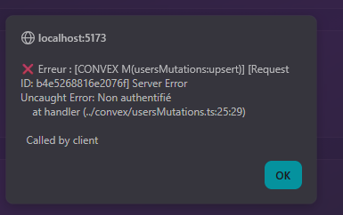

# 🚀 DÉMARRAGE RAPIDE

## ✅ Tout est prêt !

**Backend Convex** : 38 fonctions (queries + mutations)  
**Authentification** : Clerk configuré  
**Test** : Page de test complète créée

---

## 🎯 LANCER L'APPLICATION

```bash
npm run dev
```

Ouvre **http://localhost:5173**

---

## 🧪 TESTER

1. **Clique sur "Se connecter"** (en haut à droite)
2. **Crée un compte** ou connecte-toi
3. **Clique sur "Synchroniser le profil"**
4. **Crée un tournoi de test**

---

## 📚 DOCUMENTATION

- `TEST_GUIDE.md` : Guide de test détaillé
- `MIGRATION_GUIDE.md` : Comment migrer les composants
- `CLERK_AUTH_GUIDE.md` : Configuration Clerk
- `RECAP_MIGRATION.md` : Récapitulatif complet (dans `.gemini/antigravity/brain/`)

---

## 🔧 FICHIERS IMPORTANTS

### Backend (Convex)
- `convex/schema.ts` : 17 tables
- `convex/users.ts` : Queries users
- `convex/usersMutations.ts` : Mutations users
- `convex/tournaments.ts` : Queries tournois
- `convex/tournamentsMutations.ts` : Mutations tournois
- `convex/teams.ts` : Queries équipes
- `convex/teamsMutations.ts` : Mutations équipes
- `convex/matches.ts` : Queries matchs
- `convex/matchesMutations.ts` : Mutations matchs
- `convex/registrations.ts` : Queries inscriptions
- `convex/registrationsMutations.ts` : Mutations inscriptions
- `convex/chat.ts` : Chat en temps réel
- `convex/notifications.ts` : Notifications

### Frontend (React)
- `src/main.jsx` : ClerkProvider + ConvexProvider
- `src/TestAuth.tsx` : Page de test
- `src/App.jsx` : Version simplifiée (temporaire)
- `src/App.backup.jsx` : Ancien App.jsx (sauvegarde)

### Configuration
- `.env.local` : Variables d'environnement (Convex + Clerk)

---

## 🎨 FONCTIONNALITÉS DISPONIBLES

### Authentification
- ✅ Connexion / Inscription (Clerk)
- ✅ Profil utilisateur (Convex)
- ✅ Synchronisation automatique

### Tournois
- ✅ Créer un tournoi
- ✅ Lister les tournois
- ✅ Mettre à jour un tournoi
- ✅ Supprimer un tournoi

### Équipes
- ✅ Créer une équipe
- ✅ Inviter des membres
- ✅ Gérer les invitations
- ✅ Retirer des membres

### Matchs
- ✅ Lister les matchs
- ✅ Mettre à jour les scores
- ✅ Système de veto (ban/pick)
- ✅ Support BO3/BO5

### Inscriptions
- ✅ S'inscrire à un tournoi
- ✅ Check-in
- ✅ Se désinscrire

### Chat
- ✅ Chat de match en temps réel
- ✅ Historique des messages

### Notifications
- ✅ Créer des notifications
- ✅ Marquer comme lu
- ✅ Compter les non lues

---

## 🔄 REVENIR À L'ANCIEN APP

Si besoin :

```bash
Copy-Item -Path "src\App.backup.jsx" -Destination "src\App.jsx" -Force
```

---

## 🆘 PROBLÈMES ?

### L'app ne se lance pas
```bash
npm install
npm run dev
```

### Erreur "Invalid JWT"
1. Clerk Dashboard → JWT Templates → Convex
2. Convex Dashboard → Settings → Environment Variables → `CLERK_ISSUER_URL`

### Erreur "Non authentifié"
- Connecte-toi via Clerk
- Synchronise ton profil

---

**Teste maintenant et dis-moi ce que tu vois ! 🎉**
